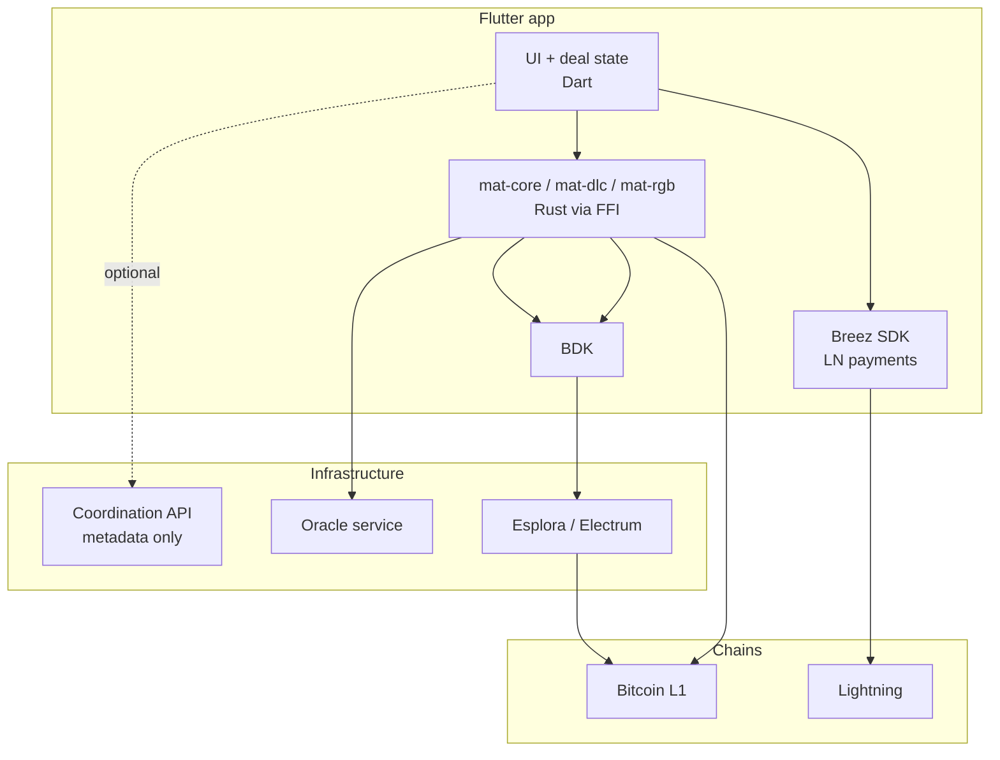

# Mobile / production implementation plan

This document sketches a path from the current **Rails + Docker PoC** to a **mobile, self-custody production** system. It preserves the deal economics (FloorEUR, DLC collateral, RGB EURT) while replacing centralized wallets, the shared DLC sidecar, and per-user RLN nodes.

For the current PoC architecture, see [README.md](../README.md).

---

## Goals

**Product:** bilateral EUR-nominal deals with BTC collateral, RGB token transfers, and FloorEUR settlement at maturity.

**Production shape:**

- Self-custody on each participant's phone (borrower + hodler keys)
- Minimal trusted infrastructure (oracle + optional coordination relay)
- Bitcoin L1 for the security anchor; Lightning for holder payouts
- Same economics as the PoC (`Payoffs::FloorEurCalculator`, DLC payout curve)

**Non-goals for v1 mobile:**

- Replacing the oracle with user-supplied price feeds
- Running a full RGB Lightning Node on every phone
- Custodial Rails settlement
- Mainnet launch in early phases

---

## Technology choices (decided)

| Area | Choice | Notes |
|------|--------|--------|
| **Mobile UI** | **Flutter** | Single codebase for iOS + Android; Dart UI with Rust FFI for protocol logic |
| **LN (Phase 5)** | **Breez SDK** | Holder distribution and Lightning UX; evaluate Spark vs Liquid variant early |
| **L1 wallet** | **BDK** (via Rust FFI) | DLC funding PSBT signing; not replaced by Breez |
| **DLC** | **mat-dlc** (Rust FFI) | Port of `dlc-rs`; not provided by Breez |
| **RGB** | **rgb-lib** (Rust FFI) | EURT; not provided by Breez |

Breez accelerates **Phase 5 and mobile delivery**; it does **not** replace `mat-core`, BDK, DLC, or RGB work.

---

## Architecture target (end state)



**Rule:** anything that can sign or spend must live on the phone. Cloud services only coordinate and attest.

---

## Current PoC vs target

| Piece | PoC today | Mobile production |
|-------|-----------|-------------------|
| UI | Rails HTML dashboard | **Flutter** app (iOS + Android) |
| Orchestrator | Rails (DB, settlement, RGB reads) | Optional relay API; deal logic on device |
| L1 wallet | `bitcoind` per user (RPC) | BDK + Esplora on device |
| DLC crypto | `dlc-rs` sidecar (shared peg/investor keys) | Embedded DLC SDK; each party holds their 2-of-2 share |
| Oracle | Pythia (Docker) | Same pattern, hosted service |
| RGB | Full RLN node per user (Docker) | `rgb-lib` on device |
| Holder payout | L1 fan-out (`Dlc::Distribution`) | **Breez SDK** — Lightning payments to holders |

The PoC proves **deal economics and the DLC + RGB story**. Production **rehomes keys and signing to devices**, keeps the **oracle** (and optionally a thin relay) in the cloud, and moves **holder distribution from L1 to LN**.

---

## Phase overview

| Phase | Duration (rough) | Outcome | Retires from PoC |
|-------|------------------|---------|------------------|
| **0** Foundation | 2–4 weeks | Shared spec + Rust core crate | — |
| **1** Mobile shell | 4–6 weeks | Read-only / mock wallet app | Rails HTML for end users |
| **2** L1 wallet | 6–8 weeks | Deposit, reserve, sign on phone | `bitcoind` per user |
| **3** DLC on device | 8–12 weeks | Activate + CET on testnet | Shared `dlc-rs` sidecar keys |
| **4** RGB on device | 8–10 weeks | EURT issue / transfer P2P | RLN Docker fleet |
| **5** LN settlement | 8–12 weeks | Holder payout via HODL invoices | L1 `Distribution` fan-out |
| **6** Production harden | ongoing | Mainnet, recovery, ops | Rails as user-facing orchestrator |

Phases 3 and 4 can overlap once BDK + DLC FFI is stable.

---

## Phase 0 — Foundation

**Objective:** one source of truth for economics and deal lifecycle, portable to mobile.

| Task | Detail |
|------|--------|
| Extract **deal kernel** | Rust library: FloorEUR calculator, payout curve, deal FSM (`pending` → `active` → `settled`) |
| Formalize **wire formats** | JSON or protobuf for offer, accept, funding PSBT, settlement package |
| Document **trust boundaries** | What the relay may store; what must be verified on device |
| Test vectors | Port `demo_interest_at_peg_spec` and payoff specs into Rust unit tests |

**PoC mapping:** lift logic from `app/services/payoffs/`, `lib/dlc/payout_curve.rb`, and `app/models/budget.rb` lifecycle.

**Exit criteria:** Rust tests green; offer/accept schema versioned.

---

## Phase 1 — Flutter shell + coordination API

**Objective:** real app UX against a read-only or mocked backend; no keys yet.

| Task | Detail |
|------|--------|
| **Flutter** project | iOS + Android from one codebase; `flutter_rust_bridge` (or similar) stub for later FFI |
| Screens | Dashboard, create deal, accept deal, transfer list, settlement summary |
| Slim **relay API** | REST: deals CRUD, notifications, market rate — **no signing, no keys** |
| Rails refactor | Split budget controllers into JSON API; keep admin on web if needed |

**PoC mapping:** `app/views/budgets/*` → Flutter screens; `Budgets::CreateService` → API (later on-device).

**Exit criteria:** demo flow walkable on phone/emulator with mocked settlement; API contract frozen.

**Delivered in repo:**

- Relay API — `config/routes.rb` → `/api/v1/*` ([relay-api-v1.md](relay-api-v1.md))
- Flutter shell — [mobile/README.md](../mobile/README.md)
- Request specs — `spec/requests/api/v1/relay_spec.rb`

---

## Phase 2 — L1 wallet on phone (BDK)

**Objective:** user-owned reserve; replace `L1::UserWallet` and bitcoind.

| Task | Detail |
|------|--------|
| BDK integration | Mnemonic, descriptor wallet, Esplora sync |
| Deposit flow | Show receive address; detect incoming transactions |
| Coin selection | Port fee buffer semantics (`FUNDING_FEE_BUFFER_SATS` in `Dlc::ContractSetupService`) |
| PSBT signing | User signs own funding inputs (preparation for DLC) |
| Backup | Seed export / encrypted backup (design early) |

**PoC mapping:** `L1::DepositReserveService`, `L1::UserWallet`, `L1::SyncReserveBalanceService`.

**Exit criteria:** on testnet: deposit → balance on phone; sign a test PSBT.

---

## Phase 3 — DLC on device

**Objective:** 2-of-2 DLC activation and CET execution with each party's key on their phone.

| Task | Detail |
|------|--------|
| Port **`dlc-rs` → mat-dlc** | Rust crate + **Flutter FFI** (`flutter_rust_bridge`) |
| P2P exchange | Offer/accept: oracle announcement, payout points, unsigned funding tx |
| Transport | QR, deep link, Nostr DM, or relay as encrypted blob store |
| Per-device signing | Peg inputs (borrower), investor inputs (hodler) |
| Oracle client | Announce at activate; attest at settle |
| CET at maturity | Local scheduler + push; either party can broadcast CET |

**PoC mapping:** `Dlc::ContractSetupService`, `Dlc::SettlementService`, `Dlc::NodeClient`, `dlc-rs/src/main.rs`.

The HTTP sidecar remains useful as a **dev/regression harness**, not for production custody.

**Exit criteria:** two devices activate and settle on testnet without shared sidecar keys.

---

## Phase 4 — RGB on device (rgb-lib)

**Objective:** EURT issue, transfer, and redeem without per-user RLN Docker.

| Task | Detail |
|------|--------|
| rgb-lib integration | Wallet, issue (issuer role), transfer, verify |
| Issuer model | Dedicated issuer service or controlled issuer device |
| P2P transfer | Consignment over same transport as DLC |
| Redeem at settle | Hook into settlement flow (prepare for Phase 5 atomicity) |

**PoC mapping:** `Rgb::*`, `Tokens::TransferService`, RLN integration specs.

**Exit criteria:** borrower → holder transfer on testnet RGB; balances correct on both phones.

---

## Phase 5 — LN holder settlement (Breez SDK)

**Objective:** scalable holder payouts via Lightning; atomic RGB redeem + BTC receipt where Breez (or a fallback) allows.

| Task | Detail |
|------|--------|
| **Breez SDK (Flutter)** | Integrate [Breez SDK](https://breez.technology/sdk/) Dart bindings; pick **Spark** or **Liquid** variant after trust-model review |
| After CET | Route peg-side proceeds into Breez balance (on-chain receive / swap — depends on chosen Breez flavour) |
| Per holder | Bolt11 (or LNURL) invoice for **exact FloorEUR sats** from `mat-core` (same rules as `ExecuteService` / `FloorEurCalculator`) |
| Pay holders | `sendPayment` (or equivalent) for each invoice — replaces L1 `Dlc::Distribution` fan-out |
| RGB redeem | Coordinate redeem with payment; spike **HODL / atomic** early — may require raw LDK if Breez cannot bind payment to RGB state |
| Failure handling | Retry queue, partial settle, on-device recovery package |
| Deprecate | `Dlc::Distribution` L1 path except explicit fallback |

**What Breez provides:** mobile LN send/receive, liquidity abstraction, persistence, passkeys (optional UX), Flutter bindings.

**What Breez does not provide:** DLC, RGB, FloorEUR math, oracle CET — those stay in Rust (`mat-core`, `mat-dlc`, `mat-rgb`) + BDK.

**PoC mapping:** `Settlements::ExecuteService`, `Dlc::Distribution`, README § pending / HODL invoices.

**Exit criteria:** multiple holders paid via Breez on testnet; interest case (e.g. €505) verified; no L1 fan-out for holders.

**Spike (before full Phase 5):** Flutter + Breez SDK — create wallet, pay a fixed-sats test invoice; confirm API key and Spark/Liquid choice.

---

## Phase 6 — Production hardening

| Area | Work |
|------|------|
| Security | Audit DLC + rgb-lib + key storage; test relay |
| Recovery | Export deal package (funding outpoint, CET txids, RGB state); DLC refund watchtower |
| Ops | Oracle HA, relay SLA, testnet → mainnet checklist |
| Compliance | Jurisdiction, KYC if required, app store policies |
| Rails | Shrink to admin/analytics or retire user-facing server |

---

## Shared codebase layout (Flutter + Rust)

```text
mat-core/           ← FloorEUR, payout curve, deal FSM (Rust)
mat-dlc/            ← port of dlc-rs; no shared custody keys (Rust)
mat-rgb/            ← rgb-lib wrapper (Rust)
mat-ffi/            ← flutter_rust_bridge (or equivalent) → Dart API

mobile/             ← Flutter app (Dart)
  lib/              ← UI, navigation, state (Riverpod/Bloc)
  packages/mat_sdk/ ← generated + hand-written Dart bindings to mat-ffi
  breez_sdk/        ← Breez SDK Flutter plugin (Phase 5)

relay/              ← optional coordination API (Go or slim Rails)
oracle/             ← Pythia or equivalent
```

**Integration model:**

- **BDK + mat-dlc + mat-rgb** — one Rust FFI surface called from Flutter for L1, DLC, RGB.
- **Breez SDK** — separate Flutter plugin for Lightning; compose at settlement time (invoice amounts from `mat-core`).

Prefer **one Rust core**; do not reimplement payoff math in Dart.

---

## PoC service mapping

| PoC component | Phase | Mobile replacement |
|---------------|-------|---------------------|
| Rails dashboard | 1 | **Flutter** UI |
| `Budgets::CreateService` | 1 → 3 | App + relay metadata |
| `Budgets::ActivateService` | 3 | P2P DLC sign |
| `Dlc::ContractSetupService` | 3 | DLC SDK on both phones |
| `L1::UserWallet` / bitcoind | 2 | BDK |
| `dlc-rs` sidecar | 3 | Embedded SDK |
| RLN Docker | 4 | rgb-lib |
| `Tokens::TransferService` | 4 | rgb-lib P2P |
| `Settlements::ExecuteService` | 3 → 5 | Local + oracle; LN in phase 5 |
| `Dlc::Distribution` | 5 | **Breez SDK** — LN payments to holder invoices |
| `Budgets::AutoSettleService` | 3 | Local alarm + push |
| `Payoffs::FloorEurCalculator` | 0 | `mat-core` |

---

## Key flows (target)

### Activate

```text
Borrower app: create offer (amount, dates, pubkey, inputs)
Hodler app:   accept + add investor inputs
Both:         sign funding tx locally (BDK)
Either:       broadcast
Issuer/RGB:   genesis + assign EURT to borrower (rgb-lib)
```

### Transfer EURT

```text
Sender rgb-lib → consignment → receiver rgb-lib (QR / Nostr / relay)
Optional relay stores encrypted consignment if recipient is offline
```

### Settle at maturity

```text
Either party:
  1. Fetch oracle attestation for spot at maturity
  2. Execute CET on L1 (pool split: peg vs hodler) — mat-dlc + BDK
  3. For each holder: invoice for exact FloorEUR sats — amount from mat-core
  4. Pay invoices via Breez SDK (hodler or distributor role)
  5. RGB redeem coordinated with payment — mat-rgb (+ atomic spike)
  6. BDK syncs L1 remainder to hodler reserve
```

Exact FloorEUR holder amounts (principal + interest) should be computed with the same rules as `Settlements::ExecuteService` and `Payoffs::FloorEurCalculator` — on device in `mat-core`, not by a trusted server.

---

## L1 vs Lightning responsibilities

| Operation | PoC | Production mobile |
|-----------|-----|---------------------|
| Collateral lock | L1 (DLC funding) | L1 |
| Hodler return | L1 (CET investor output) | L1 |
| Holder principal + interest | L1 fan-out | **Lightning** |
| EURT transfers | RGB (RLN) | RGB (rgb-lib, P2P) |
| Price at maturity | Oracle → CET | Oracle → CET |

Replacing the DLC funding transaction with a **plain Lightning channel open** does not remove the activation L1 fee or the need for oracle-enforceable settlement. LN helps most for **many holder payouts** and **repeat deals between the same pair**, not for eliminating the hodler's share of a single CET.

---

## Risks and mitigations

| Risk | Mitigation |
|------|------------|
| DLC on mobile is complex | Phase 3 spike first; keep sidecar for regression tests |
| rgb-lib maturity | Phase 4 on testnet; document L1 fallback |
| HODL / RGB–LN atomicity | Early Phase 5 spike with Breez; fallback to raw LDK if needed |
| Breez infra dependency | Document trust model (Spark/Liquid); plan for testnet → mainnet API keys |
| P2P pairing UX | QR + relay fallback in v1 |
| Flutter + Rust FFI | `flutter_rust_bridge`; CI for iOS/Android native builds |

---

## Early decisions

| Decision | Status | Choice |
|----------|--------|--------|
| Mobile framework | **Decided** | **Flutter** |
| LN SDK (Phase 5) | **Decided** | **Breez SDK** (Spark vs Liquid — pick during Phase 5 spike) |
| Issuer | Open | Always-on service vs dedicated issuer device |
| Relay | Open | Required for v1 vs QR-only P2P |
| Testnet | Open | Signet, mutinynet, or hosted regtest for CI |

---

## Suggested first 90 days

| Weeks | Focus |
|-------|--------|
| 1–3 | Phase 0: Rust `mat-core`, JSON schemas, port payoff tests |
| 4–8 | Phase 1: **Flutter** UI + relay API; read-only demo |
| 9–14 | Phase 2: BDK via Rust FFI; deposit / sign on testnet |
| 15–18 | Phase 3 spike: two devices fund + settle one DLC deal |
| (parallel) | Optional: Breez SDK Flutter spike (pay test invoice) before Phase 5 |

---

## Production v1 definition of done

- Borrower and hodler each use **their own phone**; keys never on the server.
- Activate: **one L1 funding transaction**; no shared sidecar keys.
- Transfer EURT **phone-to-phone**.
- Settle: **CET on L1**; holders paid via **Breez SDK (Lightning)** with FloorEUR amounts including interest.
- Recovery: user can restore wallet and inspect deal status from an exported package.

---

## Related documents

- [relay-api-v1.md](relay-api-v1.md) — Phase 1 REST API contract
- [mobile/README.md](../mobile/README.md) — Flutter shell
- [mat-core/README.md](../mat-core/README.md) — Phase 0 Rust kernel (FloorEUR, wire schemas, test vectors)
- [README.md](../README.md) — current PoC architecture and LN roadmap
- [README-ita.md](../README-ita.md) — Italian overview
- [dlc-rs/README.md](../dlc-rs/README.md) — sidecar / rust-dlc integration (PoC)
- [Breez SDK](https://breez.technology/sdk/) — Lightning embed for Flutter (Phase 5)
- [Breez SDK — Spark docs](https://sdk-doc-spark.breez.technology/) — integration reference
