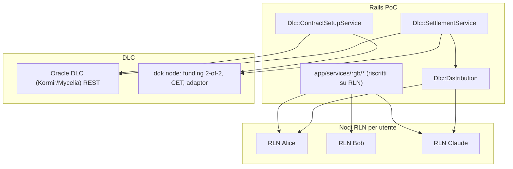

# Piano: RGB su RLN + DLC reale (M4, assorbe M5)

> Stato: pianificato (in corso). Questo documento e la versione versionata del piano di implementazione concordato. Vedi anche [`P2P-OPTIONS.md`](P2P-OPTIONS.md), [`MULTISIG-SPEC.md`](MULTISIG-SPEC.md), [`PAYOFF-SPEC.md`](PAYOFF-SPEC.md), [`RGB-FIRST.md`](RGB-FIRST.md).

## Obiettivo

Due cambi strutturali insieme:

- **(A) RGB interamente su RLN**: il RGB Lightning Node sostituisce `rgb-sidecar` come unico stack RGB (issuance, cessioni, saldi, distribuzione). **Un nodo RLN per utente**. Elimina il doppio stack e la riconciliazione.
- **(B) DLC reale**: settlement FloorEUR via oracle DLC reale (REST, Kormir/Mycelia Signal) + nodo DLC `ddk` (dlcdevkit) con funding **2-of-2**, CET, **adaptor signatures reali**, refund. La CET paga `peg_pot + investor`; il `peg_pot` e distribuito agli N holder **nativamente via RLN**.

Il path DLC sostituisce l'escrow 2-of-3 (legacy/fallback); il bot esce dal multisig (resta facilitatore/oracle).

## Endpoint RLN (verificati da OpenAPI)

- Wallet/nodo: `/init`, `/unlock`, `/lock`, `/nodeinfo`, `/address`, `/createutxos`, `/btcbalance`, `/sync`.
- RGB: `/issueassetnia`, `/listassets`, `/assetbalance`, `/rgbinvoice`, `/decodergbinvoice`, `/sendasset`, `/refreshtransfers`, `/listtransfers`.
- LN: `/connectpeer`, `/openchannel`, `/listchannels`, `/lninvoice`, `/sendpayment`, `/keysend`.
- Atomicita: `/hodlinvoice`, `/settlehodlinvoice`, `/cancelhodlinvoice`, `/getpaymentpreimage`, `/invoicestatus`, `/rgbinvoicehtlc`, `/htlcclaim`.

## Architettura

## Workstream A — RGB su RLN

- **Infra**: N nodi RLN (uno per utente demo: admin/alice/bob/claude/david) su bitcoind/electrs/rgb-proxy condivisi. `bin/regtest` li avvia/init/unlock. `BtcAccount` mappa l'utente al nodo (`rln_node_url`, token, `node_pubkey`).
- **Client**: `lib/rgb/lightning_client.rb` copre gli endpoint sopra; per-nodo (URL/token dell'utente).
- **Riscrittura `app/services/rgb/*`**:
  - `WalletSetupService` -> init+unlock+address+createutxos del nodo utente.
  - `IssueService`/`LibIssueService` -> `/issueassetnia` sul nodo borrower.
  - `BalanceService` -> `/assetbalance` (fallback proiezione DB invariato).
  - `TransferService`/`LibTransferService` (cessioni) -> destinatario `/rgbinvoice` + mittente `/sendasset` (on-chain). LN come opzione.
  - `RedeemService` -> redemption verso nodo issuer/treasury via `/sendasset`.
  - `ProjectionService` invariata (cache DB).
  - Rimuovere `Rgb::SidecarClient` e `rgb-sidecar/app.py`.
- **Cessioni**: baseline **on-chain** via RLN (`sendasset`), nessun canale richiesto. LN (canali + invoice) come enhancement.

## Workstream B — DLC reale

- **Oracle**: `lib/dlc/oracle_client.rb` (Kormir/Mycelia, REST). Announcement numeric per-digit all'activation; attestation a maturity.
- **Nodo DLC**: `lib/dlc/node_client.rb` verso `ddk` (gRPC o shim REST). Funding **2-of-2** {peg, investor}, payout FloorEUR per outcome (`Payoffs::FloorEurCalculator`), CET, adaptor, execute(attestation), refund.
- **Setup** (activation): `Dlc::ContractSetupService` hook in `L1::ProvisionEscrowService` dietro `Dlc::Config.enabled?`.
- **Settlement** (maturity): `Dlc::SettlementService` in `Settlements::ExecuteService#settle!`; broadcast CET (peg_pot + investor); fallback 2-of-3 legacy.

## Distribuzione peg_pot -> N holder (via RLN)

- Letta l'allocazione RGB **corrente** a maturity; per ogni holder share pro-rata del `peg_pot`.
- **Baseline**: `/sendasset` on-chain dal nodo distributore a ciascun holder.
- **Atomica (LN)**: `/hodlinvoice` con `payment_hash` derivato dal segreto oracle `s` (rivelato dall'attestation/CET) -> il holder incassa solo quando `s` e noto; `/settlehodlinvoice` al reveal. Caveat: l'atomicita perfetta richiede PTLC (Taproot) — qui best-effort con HODL/preimage.

## Persistenza

- `DlcContract`: `oracle_event_id`, `ddk_contract_id`, `funding_outpoint`, `status`.
- `DlcSettlement`: `cet_txid`, `outcome`, `attestation`, `peg_pot_sats`, `investor_sats`.
- `BtcAccount` (+campi RLN): `rln_node_url`, `rln_token`, `node_pubkey` (sostituiscono `rgb_wallet_id`/`rgb_mnemonic`).

## Caveat / rischi

- **Multi-nodo**: un RLN per utente -> infra demo piu pesante (init/unlock/funding per nodo); reset demo deve resettare N nodi.
- **Riscrittura ampia** del layer `Rgb::` + spec `:rgb_lib` (rischio regressioni; mitigare con stub RLN e fasi).
- **ddk Rust/gRPC**: serve client gRPC Ruby o shim REST; wallet/chiavi gestiti da ddk (escrow L1 esistente diventa legacy nel path DLC).
- **Atomicita distribuzione**: HODL/preimage e best-effort; PTLC reale = lavoro di frontiera. NB: la versione vendored RGB-Tools NON espone gli endpoint `hodlinvoice/settlehodlinvoice/...` (presenti solo nel fork RGB-OS/build piu recenti). B.3 dovra usare baseline on-chain `/sendrgb` e, per l'atomicita LN, aggiornare il submodule o adottare il fork. I metodi HODL nel client sono predisposti ma 404 sulla versione attuale.
- **Path B refund**: 2-of-2 a peg+investor; cessionari non distribuiti (rivalsa verso cedente) — documentato.

## Test

- Unit: `rgb/lightning_client`, `dlc/oracle_client`, `dlc/node_client` con stub HTTP/gRPC; `Rgb::*` riscritti con stub RLN; `dlc/distribution` (somma share==peg_pot, pro-rata su allocazione corrente).
- Integration (`:regtest`): end-to-end con nodi RLN reali + oracle reale + ddk (funding 2-of-2, CET broadcast) + distribuzione RLN. Estende `bin/demo-spec`/`bin/system-spec`.

## Fasi (incrementi verificabili)

1. **A.1** Infra N nodi RLN + `lib/rgb/lightning_client.rb` + healthcheck (isolato).
2. **A.2** Riscrittura `app/services/rgb/*` su RLN (issue/cessione/saldo/redeem) + spec verdi: l'app funziona come oggi ma su RLN, senza DLC.
3. **B.1** Oracle reale (`oracle_client`) su regtest.
4. **B.2** `node_client` + `ContractSetupService` + `SettlementService` (funding 2-of-2 + CET reale broadcast).
5. **B.3** `Dlc::Distribution` (on-chain, poi HODL atomico) + recovery export + doc + integration end-to-end.

## Checklist implementativa

- [x] A.1 client RLN `lib/rgb/lightning_client.rb` + `lib/rgb/nodes.rb` + config + spec
- [x] A.1 infra nodi RLN: submodule `vendor/rgb-lightning-node` + `docker/rln.Dockerfile` (build debug) + 5 nodi in `docker-compose.regtest.yml` (3001-3005) + `bin/regtest` (build/attesa) + mapping utente->nodo in `DemoData::ResetService`. Validato end-to-end su nodo reale (unlock/fund/createutxos/issueassetnia/assetbalance) e client allineato all'API vendored (`/sendrgb` recipient_map, `rgbinvoice` con `witness`, `unlock` con `announce_addresses`, `refreshtransfers` con `filter`)
- [x] A.2 riscrittura `app/services/rgb/*` su RLN (issue/cessione/saldo/redeem/wallet) + migration `btc_accounts` (rln_node_url/rln_token/node_pubkey) + dashboard/reset/rescue
- [x] A.2 unit spec aggiornati (`redeem_service`, `transfer_service`, `l1_unit_stubs` mirror) — suite unit verde
- [x] A.2 (regtest) riscrittura spec `:rgb_lib` su nodi RLN reali (`spec/integration/rgb_lib_transfer_spec.rb` con `:regtest`, saldi letti dai nodi) + provisioning/funding nodi in `WalletSetupService` + conferma on-chain transfer/redeem via `Rgb::NodeConfirm` (mining+refresh su regtest) + `indexer_url` `tcp://electrs:50001`. Rimozione completa `rgb-sidecar/` + `Rgb::SidecarClient` + `Config.{sidecar_url,ensure_sidecar!,wallet_id_for}` + servizio compose `rgb-sidecar`/volume + script (`bin/dev`/`bin/demo-spec`/`bin/system-spec` ora sondano `:3001/nodeinfo`)
- [x] B.1 `lib/dlc/oracle_client.rb` (announce/attest numeric per-digit, REST Kormir) + `lib/dlc/numeric.rb` (decomposizione base-2 per-digit) + `lib/dlc/config.rb` (gate `DLC_ENABLED`, parametri FloorEUR) + spec (HTTP stub)
- [x] B.1/B.2 `lib/dlc/node_client.rb` (shim REST ddk: create/execute/refund — funding 2-of-2, CET, adaptor e refund gestiti dal shim) + `lib/dlc/payout_curve.rb` (schedule FloorEUR per outcome via `FloorEurCalculator`) + spec (HTTP stub). NB: client gRPC ddk reale rinviato a B.3
- [x] B.2 migration `create_dlc_tables` + modelli `DlcContract` / `DlcSettlement` + associazioni `Budget` (`has_one :dlc_contract/:dlc_settlement`)
- [x] B.2 `Dlc::ContractSetupService` (announce oracle + payout curve + create contract + persist) + hook in `L1::ProvisionEscrowService` (gated `Dlc::Config.enabled?`) + spec
- [x] B.2 `Dlc::SettlementService` (attest + execute CET + persist) + hook in `Settlements::ExecuteService#settle!` (gated, broadcast CET con fallback PSBT escrow legacy) + spec
- [x] B.3 `Dlc::Distribution` (split `peg_pot` pro-rata sull'allocazione corrente + fan-out on-chain via `NodeClient#distribute`, persistito nel recovery package) + hook in `Settlements::ExecuteService#settle_via_dlc!` + spec. NB: variante atomica LN/HODL predisposta nel client ma non disponibile sul nodo vendored
- [x] B.3 export recovery package DLC (`lib/dlc/recovery_package.rb`: oracle announcement/attestation, contract/funding, CET, refund) + merge in `budget.recovery_package["dlc"]` + spec
- [~] B.3 integration `:dlc_integration`/`:regtest` end-to-end (`spec/integration/dlc/dlc_settlement_spec.rb`) — scaffold pronto, **skippa** finché Kormir + ddk non sono nello stack compose (infra residua). Doc aggiornati (`RGB-FIRST`/`MULTISIG-SPEC`/`P2P-OPTIONS`)

> **Infra residua (B.3)**: aggiungere oracle Kormir e nodo ddk (shim REST sugli endpoint `/contracts*`) a `docker-compose.regtest.yml`; sostituire la `PayoutCurve` campionata con la payout-function nativa di rust-dlc; sostituire la `RedeemService` best-effort con la distribuzione DLC come meccanismo autorevole (vedi §"Best-effort redemption").

---

## Aggiornamento (giugno 2026): nodo DLC reale su `rust-dlc` — **Variante B implementata**

> Stato: **funzionante end-to-end su regtest** — CREATE / EXECUTE / REFUND / DISTRIBUTE tutti verdi contro l'oracle Pythia. Lo storico blocker `NULLFAIL` su EXECUTE è risolto.

### Contesto e scelta dell'oracle

La fase B è stata realizzata con **oracle Pythia** (`dlc-markets/pythia`, fork di sibyls) anziché Kormir, perché Pythia espone `POST /v1/force {maturation, price}` per **forzare l'attestazione** di un (maturity, price) arbitrario — indispensabile per un regtest deterministico — ed è REST + Postgres (nessun gRPC/Rust applicativo da scrivere lato oracle). Kormir resta valido ma le sue route non combaciavano col nostro `OracleClient` e non offre un force-attest comodo.

### Il blocker EXECUTE e la sua causa

Il **primo** nodo DLC fu uno shim Node.js (`dlc-shim/`) che avvolgeva `@atomicfinance` + **`cfd-dlc-js`**. Funzionava per funding/refund/distribute ma la CET di EXECUTE veniva **rifiutata da bitcoind con `NULLFAIL`** ("Signature must be zero for failed CHECKMULTISIG"). Diagnosi conclusiva: tutti i pezzi verificavano isolatamente (adaptor valido, indice CET corretto, `s_i·G == ComputeSigPoint`), ma la firma CET decifrata restava invalida → **incompatibilità del calcolo del punto della firma ECDSA-adaptor tra `cfd-dlc-js` (atomicfinance) e l'attestation `rust-dlc` di Pythia**.

### Soluzione: sidecar Rust `dlc-rs/` su `rust-dlc`

Il nodo DLC è stato riscritto come **sidecar Rust** (`dlc-rs/`, servizio compose `dlc-node`) costruito su **`rust-dlc`** (`dlc` + `dlc-trie` + `dlc-messages`), **pinnato allo stesso commit che usa Pythia** (`p2pderivatives/rust-dlc` @ `fe0e0764`) e `secp256k1-zkp 0.11`. Poiché oracle e nodo condividono lo stesso codice crittografico, il punto della firma adaptor e la decomposizione dei valori-s dell'oracle (`signatures_to_secret`) coincidono **byte-per-byte** → EXECUTE valido.

Punti chiave dell'implementazione:

- **Stesso contratto REST** dello shim precedente (`/info`, `POST /contracts`, `GET /contracts/:id`, `POST /contracts/:id/{execute,refund,distribute}`): **zero modifiche** a `Dlc::NodeClient` lato Ruby.
- **Deserializzazione diretta** dell'announcement Pythia negli struct `dlc_messages::oracle_msgs::OracleAnnouncement` (serde) — nessun parsing manuale.
- **Numeric/digit-decomposition** via `MultiOracleTrie`; messaggio per-cifra `sha256(digit)` + `schnorrsig_compute_sig_point` (identico a Pythia).
- **Curva FloorEUR**: `peg = K/price` campionata sui punti del deal, arrotondata (bucket configurabili `DLC_ROUNDING_BUCKETS`) e coalizzata in `RangePayout` (un CET per intervallo).
- **PoC in-process**: il sidecar tiene entrambe le chiavi (peg=offerer, investor=acceptor), finanzia il 2-of-2 da un wallet bitcoind regtest, firma gli input P2WPKH, fa broadcast e — a maturity — decifra l'adaptor accept-side con l'attestation e co-firma con la chiave peg (`dlc::sign_cet`).
- **Build**: Dockerfile multi-stage (layer di sole dipendenze per cache), `platform: linux/amd64`.

### Compose

`docker-compose.regtest.yml` (profilo `dlc`): `bitcoind` + `pythia-db` + `pythia` + `dlc-node` (build da `./dlc-rs`). Lo shim Node.js legacy resta in `./dlc-shim` solo come riferimento storico.

### Variante A (alternativa futura): `ddk-node` completo

Se in futuro serve un **vero nodo DLC peer-to-peer** anziché il sidecar in-process:

- **`ddk-node`** (dlcdevkit, v1.1.x): nodo DLC pronto con **gRPC** + CLI, basato su `ddk`/`rust-dlc`.
- Richiede: bitcoin node + **esplora** (electrs con API Esplora) + **oracle server** (Kormir, HTTP/Nostr).
- **Transport Nostr** (default) o gossip LN → modello a due nodi (peg + investor) con relay; **wallet BDK** proprio (funding separato da bitcoind).
- Pro: nodo "vero", spec-compliant, mantenuto. Contro: rifà M1 (Pythia→Kormir) + M2 su uno stack più pesante (2 nodi + relay + esplora + client gRPC).
- Compatibilità crittografica garantita comunque (ddk+Kormir sono entrambi `rust-dlc`).

Poiché lo stesso motore `rust-dlc` è già in casa nel sidecar (`dlc-rs/`), un'eventuale migrazione a `ddk-node` riuserebbe gli stessi concetti (announcement/attestation, trie numerica, payout iperbolica).

### Wiring lato Ruby — **completato e verde end-to-end**

> Stato: il percorso DLC è cablato nei servizi Rails e il test di integrazione `spec/integration/dlc/dlc_settlement_spec.rb` passa contro lo stack reale (Pythia + sidecar `dlc-rs` + RLN), con CET e distribuzione realmente trasmessi on-chain.

- **Oracle provider**: `Dlc::Config.oracle_provider = "pythia"` (default). `oracle_client` istanzia `PythiaOracleClient`. Le route Pythia (announcement GET, attestation `POST /v1/force`) sono già coperte dal client; gli `event_id` applicativi (`deal-<budget.id>`) restano lato nostro mentre Pythia deriva il proprio da `(asset_pair, maturity)` — irrilevante perché attestazione e announcement sono legati alla **stessa maturity**.
- **Maturity dell'evento oracle**: Pythia è un price-feed che pre-pianifica gli announcement a pochi minuti dal presente, quindi non ha un announcement per la maturity-calendario (lontana) del deal. `Dlc::Config.oracle_maturity_epoch` allinea perciò l'evento DLC a uno **slot near-future** schedulato (override deterministico via `DLC_ORACLE_MATURITY_EPOCH`); la maturity economica del budget continua a governare il timelock di refund e la business logic. `ContractSetupService` memoizza l'epoch così che venga **annunciato, persistito e poi attestato** lo stesso slot.
- **Distribuzione del `peg_pot`**: in settlement il redeem RGB azzera i `token_account`, quindi `Settlements::ExecuteService` cattura uno **snapshot pre-redeem** delle quote holder e lo passa a `Dlc::Distribution(shares:)` (fallback ai saldi DB quando assente). Il resolver di default degli indirizzi usa `Rgb::WalletSetupService.ensure_for!` per **inizializzare/sbloccare** il nodo RLN dell'holder prima di richiedere l'indirizzo on-chain.
- **Sidecar**: `handle_create` ora invoca `chain.ensure()` (crea/finanzia i wallet bitcoind) così sopravvive a un reset della chain regtest tra una run e l'altra.
- **Test**: `DLC_ENABLED=true bundle exec rspec spec/integration/dlc/dlc_settlement_spec.rb` → CREATE (funded) / EXECUTE (CET broadcast) / DISTRIBUTE (peg_pot fan-out) tutti verdi; le unit (`spec/services/dlc/*`, `execute_service_dlc_spec`) restano verdi.
