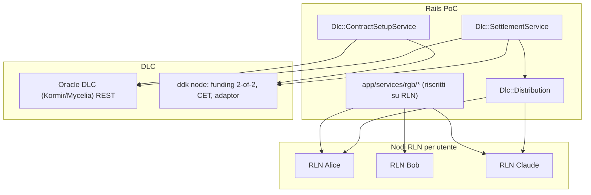

# Piano: RGB su RLN + DLC reale (M4, assorbe M5)

> Stato: pianificato (in corso). Questo documento e la versione versionata del piano di implementazione concordato. Vedi anche [`P2P-OPTIONS.md`](P2P-OPTIONS.md), [`MULTISIG-SPEC.md`](MULTISIG-SPEC.md), [`PAYOFF-SPEC.md`](PAYOFF-SPEC.md), [`RGB-FIRST.md`](RGB-FIRST.md).

## Obiettivo

Due cambi strutturali insieme:

- **(A) RGB interamente su RLN**: il RGB Lightning Node sostituisce `rgb-sidecar` come unico stack RGB (issuance, cessioni, saldi, distribuzione). **Un nodo RLN per utente**. Elimina il doppio stack e la riconciliazione.
- **(B) DLC reale**: settlement FloorEUR via oracle DLC reale (REST, Kormir/Mycelia Signal) + nodo DLC `ddk` (dlcdevkit) con funding **2-of-2**, CET, **adaptor signatures reali**, refund. La CET paga `peg_pot + investor`; il `peg_pot` e distribuito agli N holder **nativamente via RLN**.

Il path DLC sostituisce l'escrow 2-of-3 (legacy/fallback); il bot esce dal multisig (resta facilitatore/oracle).

## Endpoint RLN (verificati da OpenAPI)

- Wallet/nodo: `/init`, `/unlock`, `/lock`, `/nodeinfo`, `/address`, `/createutxos`, `/btcbalance`, `/sync`.
- RGB: `/issueassetnia`, `/listassets`, `/assetbalance`, `/rgbinvoice`, `/decodergbinvoice`, `/sendasset`, `/refreshtransfers`, `/listtransfers`.
- LN: `/connectpeer`, `/openchannel`, `/listchannels`, `/lninvoice`, `/sendpayment`, `/keysend`.
- Atomicita: `/hodlinvoice`, `/settlehodlinvoice`, `/cancelhodlinvoice`, `/getpaymentpreimage`, `/invoicestatus`, `/rgbinvoicehtlc`, `/htlcclaim`.

## Architettura

## Workstream A — RGB su RLN

- **Infra**: N nodi RLN (uno per utente demo: admin/alice/bob/claude/david) su bitcoind/electrs/rgb-proxy condivisi. `bin/regtest` li avvia/init/unlock. `BtcAccount` mappa l'utente al nodo (`rln_node_url`, token, `node_pubkey`).
- **Client**: `lib/rgb/lightning_client.rb` copre gli endpoint sopra; per-nodo (URL/token dell'utente).
- **Riscrittura `app/services/rgb/*`**:
  - `WalletSetupService` -> init+unlock+address+createutxos del nodo utente.
  - `IssueService`/`LibIssueService` -> `/issueassetnia` sul nodo borrower.
  - `BalanceService` -> `/assetbalance` (fallback proiezione DB invariato).
  - `TransferService`/`LibTransferService` (cessioni) -> destinatario `/rgbinvoice` + mittente `/sendasset` (on-chain). LN come opzione.
  - `RedeemService` -> redemption verso nodo issuer/treasury via `/sendasset`.
  - `ProjectionService` invariata (cache DB).
  - Rimuovere `Rgb::SidecarClient` e `rgb-sidecar/app.py`.
- **Cessioni**: baseline **on-chain** via RLN (`sendasset`), nessun canale richiesto. LN (canali + invoice) come enhancement.

## Workstream B — DLC reale

- **Oracle**: `lib/dlc/oracle_client.rb` (Kormir/Mycelia, REST). Announcement numeric per-digit all'activation; attestation a maturity.
- **Nodo DLC**: `lib/dlc/node_client.rb` verso `ddk` (gRPC o shim REST). Funding **2-of-2** {peg, investor}, payout FloorEUR per outcome (`Payoffs::FloorEurCalculator`), CET, adaptor, execute(attestation), refund.
- **Setup** (activation): `Dlc::ContractSetupService` hook in `L1::ProvisionEscrowService` dietro `Dlc::Config.enabled?`.
- **Settlement** (maturity): `Dlc::SettlementService` in `Settlements::ExecuteService#settle!`; broadcast CET (peg_pot + investor); fallback 2-of-3 legacy.

## Distribuzione peg_pot -> N holder (via RLN)

- Letta l'allocazione RGB **corrente** a maturity; per ogni holder share pro-rata del `peg_pot`.
- **Baseline**: `/sendasset` on-chain dal nodo distributore a ciascun holder.
- **Atomica (LN)**: `/hodlinvoice` con `payment_hash` derivato dal segreto oracle `s` (rivelato dall'attestation/CET) -> il holder incassa solo quando `s` e noto; `/settlehodlinvoice` al reveal. Caveat: l'atomicita perfetta richiede PTLC (Taproot) — qui best-effort con HODL/preimage.

## Persistenza

- `DlcContract`: `oracle_event_id`, `ddk_contract_id`, `funding_outpoint`, `status`.
- `DlcSettlement`: `cet_txid`, `outcome`, `attestation`, `peg_pot_sats`, `investor_sats`.
- `BtcAccount` (+campi RLN): `rln_node_url`, `rln_token`, `node_pubkey` (sostituiscono `rgb_wallet_id`/`rgb_mnemonic`).

## Caveat / rischi

- **Multi-nodo**: un RLN per utente -> infra demo piu pesante (init/unlock/funding per nodo); reset demo deve resettare N nodi.
- **Riscrittura ampia** del layer `Rgb::` + spec `:rgb_lib` (rischio regressioni; mitigare con stub RLN e fasi).
- **ddk Rust/gRPC**: serve client gRPC Ruby o shim REST; wallet/chiavi gestiti da ddk (escrow L1 esistente diventa legacy nel path DLC).
- **Atomicita distribuzione**: HODL/preimage e best-effort; PTLC reale = lavoro di frontiera. NB: la versione vendored RGB-Tools NON espone gli endpoint `hodlinvoice/settlehodlinvoice/...` (presenti solo nel fork RGB-OS/build piu recenti). B.3 dovra usare baseline on-chain `/sendrgb` e, per l'atomicita LN, aggiornare il submodule o adottare il fork. I metodi HODL nel client sono predisposti ma 404 sulla versione attuale.
- **Path B refund**: 2-of-2 a peg+investor; cessionari non distribuiti (rivalsa verso cedente) — documentato.

## Test

- Unit: `rgb/lightning_client`, `dlc/oracle_client`, `dlc/node_client` con stub HTTP/gRPC; `Rgb::*` riscritti con stub RLN; `dlc/distribution` (somma share==peg_pot, pro-rata su allocazione corrente).
- Integration (`:regtest`): end-to-end con nodi RLN reali + oracle reale + ddk (funding 2-of-2, CET broadcast) + distribuzione RLN. Estende `bin/demo-spec`/`bin/system-spec`.

## Fasi (incrementi verificabili)

1. **A.1** Infra N nodi RLN + `lib/rgb/lightning_client.rb` + healthcheck (isolato).
2. **A.2** Riscrittura `app/services/rgb/*` su RLN (issue/cessione/saldo/redeem) + spec verdi: l'app funziona come oggi ma su RLN, senza DLC.
3. **B.1** Oracle reale (`oracle_client`) su regtest.
4. **B.2** `node_client` + `ContractSetupService` + `SettlementService` (funding 2-of-2 + CET reale broadcast).
5. **B.3** `Dlc::Distribution` (on-chain, poi HODL atomico) + recovery export + doc + integration end-to-end.

## Checklist implementativa

- [x] A.1 client RLN `lib/rgb/lightning_client.rb` + `lib/rgb/nodes.rb` + config + spec
- [x] A.1 infra nodi RLN: submodule `vendor/rgb-lightning-node` + `docker/rln.Dockerfile` (build debug) + 5 nodi in `docker-compose.regtest.yml` (3001-3005) + `bin/regtest` (build/attesa) + mapping utente->nodo in `DemoData::ResetService`. Validato end-to-end su nodo reale (unlock/fund/createutxos/issueassetnia/assetbalance) e client allineato all'API vendored (`/sendrgb` recipient_map, `rgbinvoice` con `witness`, `unlock` con `announce_addresses`, `refreshtransfers` con `filter`)
- [x] A.2 riscrittura `app/services/rgb/*` su RLN (issue/cessione/saldo/redeem/wallet) + migration `btc_accounts` (rln_node_url/rln_token/node_pubkey) + dashboard/reset/rescue
- [x] A.2 unit spec aggiornati (`redeem_service`, `transfer_service`, `l1_unit_stubs` mirror) — suite unit verde
- [ ] A.2 (regtest) riscrittura spec `:rgb_lib` su nodi RLN reali + rimozione `rgb-sidecar`/`Rgb::SidecarClient` (legacy mantenuto fino ad allora)
- [ ] B.1 `lib/dlc/oracle_client.rb` (announce/attest numeric per-digit) + spec
- [ ] B.1/B.2 `lib/dlc/node_client.rb` (ddk: funding 2-of-2, CET, adaptor, execute, refund)
- [ ] B.2 migration + modelli `DlcContract` / `DlcSettlement`
- [ ] B.2 `Dlc::ContractSetupService` + hook in `L1::ProvisionEscrowService`
- [ ] B.2 `Dlc::SettlementService` + hook in `Settlements::ExecuteService#settle!`
- [ ] B.3 `Dlc::Distribution` (on-chain `/sendasset`, poi HODL atomico)
- [ ] B.3 export recovery package (oracle/contract/CET/refund)
- [ ] B.3 integration `:regtest` end-to-end + doc (`P2P-OPTIONS`/`MULTISIG-SPEC`/`RGB-FIRST`)
